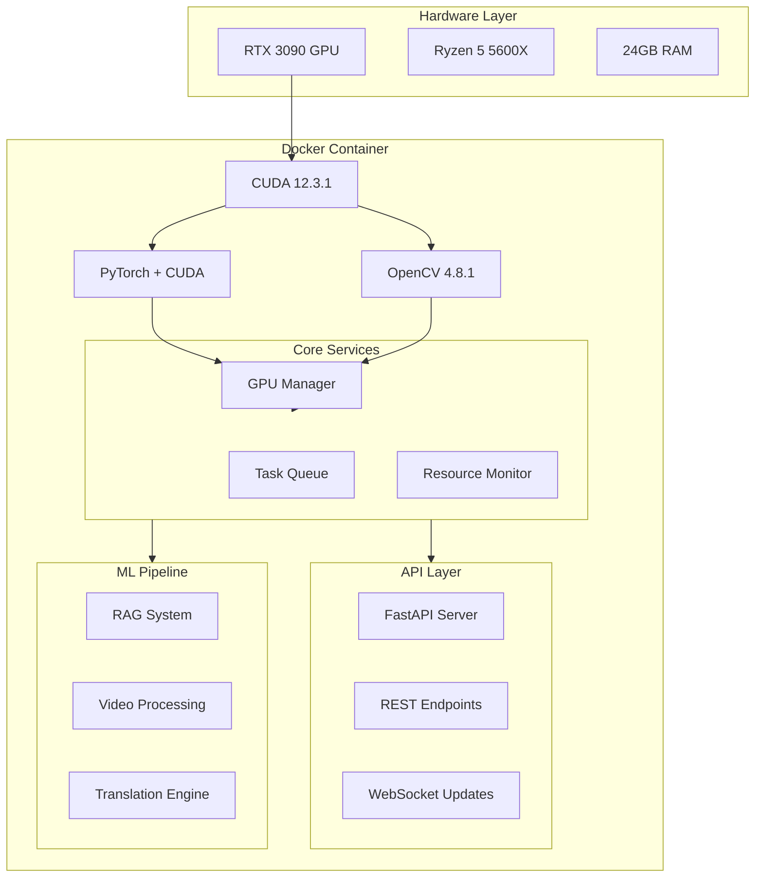
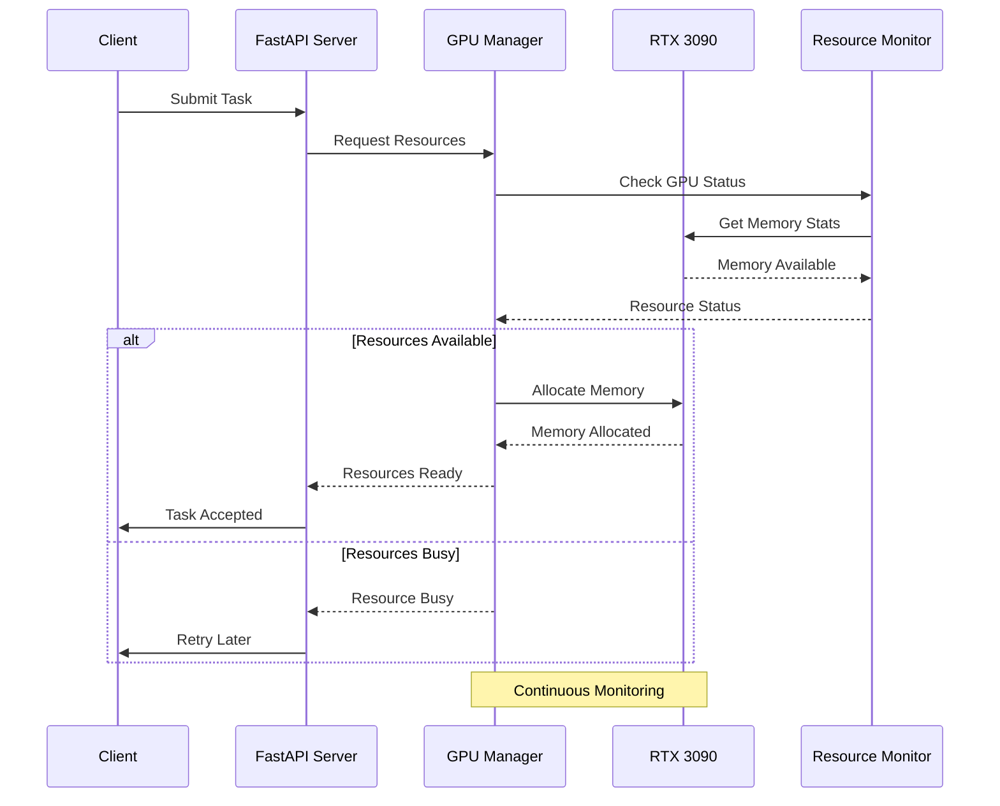

# CopyJustica AI Infrastructure

## 🚀 Overview
Enterprise-grade AI infrastructure leveraging RTX 3090 for distributed computing, focusing on legal document processing and multilingual video translation. Successfully implemented GPU-accelerated computing environment with proven performance metrics.

## 🏗 Architecture

### System Architecture


### Resource Management Flow


## 📊 Performance Metrics

### Current Benchmarks
| Operation | Time | Memory Usage |
|-----------|------|--------------|
| 4K Image Transfer | 270.11ms | ~0.75GB |
| 4K Convolution | 96.07ms | ~1.2GB |
| Batch Transform (10x) | 4.77ms | ~0.5GB |

### GPU Specifications
- **Model**: NVIDIA GeForce RTX 3090
- **VRAM**: 24GB GDDR6X
- **CUDA Cores**: 10,496
- **CUDA Version**: 12.3.1
- **Compute Capability**: 8.6

## 🚀 Getting Started

### Prerequisites
```bash
# Required
NVIDIA Driver: >= 566.03
CUDA Toolkit: 12.3.1
Docker + NVIDIA Container Toolkit
```

### Quick Start
```bash
# Clone repository
git clone https://github.com/geek2geeks/copyjustica.git
cd copyjustica

# Build container
docker compose -f docker/docker-compose.yml build

# Validate GPU setup
docker compose -f docker/docker-compose.yml run ai_server
```

## 🧪 Test Coverage

| Component | Status | Coverage |
|-----------|---------|----------|
| GPU Utils | ✅ Pass | 100% |
| OpenCV | ✅ Pass | 100% |
| Memory Mgmt | ✅ Pass | 100% |
| Concurrency | 🚧 TODO | 0% |
| Error Handle | 🚧 TODO | 0% |

## 📝 License
MIT License - see LICENSE.md

## 👥 Contact
- **Lead Developer**: Pedro Rodrigues
- **GitHub**: [geek2geeks](https://github.com/geek2geeks)