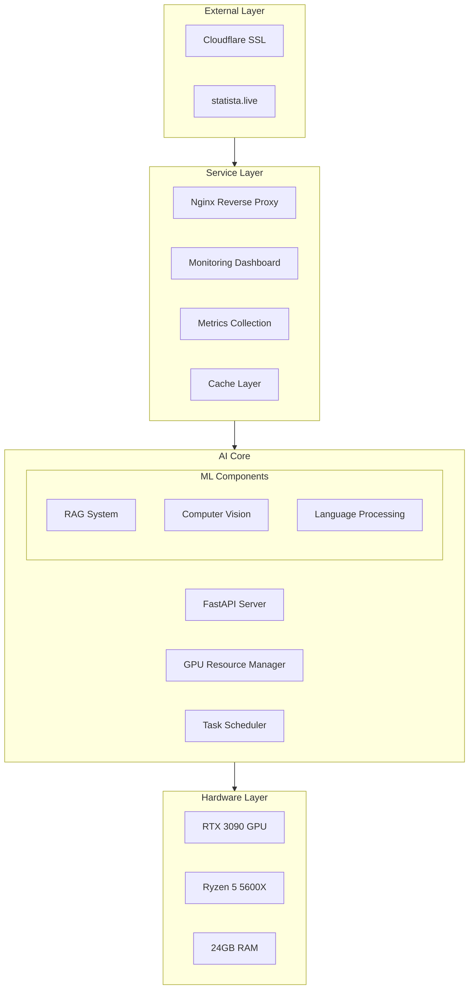
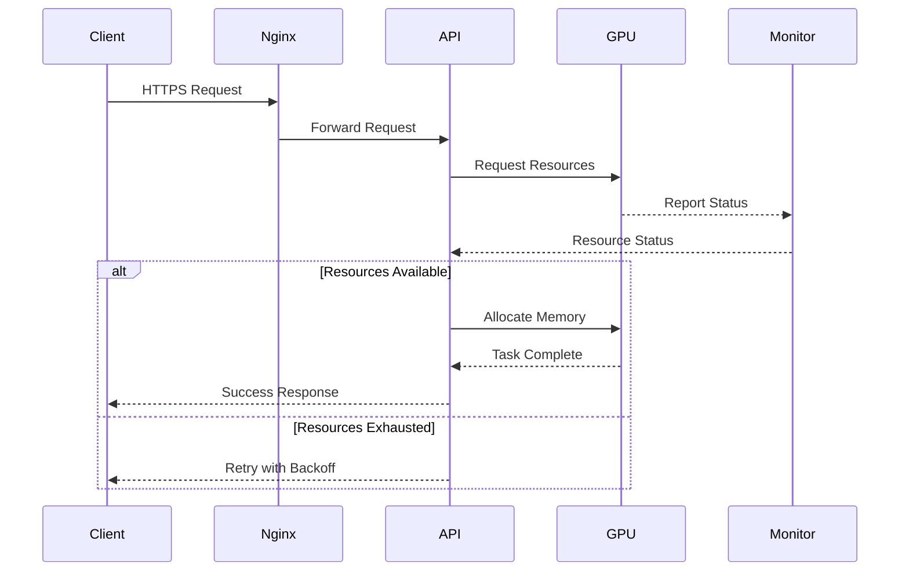

# GPU-Accelerated AI Server Infrastructure

## 🚀 Overview
Enterprise-grade AI infrastructure leveraging RTX 3090 (24GB VRAM) for distributed computing, designed for high-performance AI applications.


## 🏗 Architecture

### System Architecture


### Resource Management


## 💻 Core Components

### AI Server
- FastAPI-based REST API
- Real-time GPU resource management
- Task queue and scheduling
- Automatic memory optimization

### Monitoring
- Real-time GPU metrics
- System resource tracking
- Task performance analytics
- Alert system

### Security
- Cloudflare SSL/TLS
- Rate limiting
- Authentication system
- Network isolation

## 📊 Performance Metrics

### GPU Benchmarks
```python
# Latest benchmark results
{
    "matmul_10000x10000": {
        "compute_time_ms": 84.02,
        "tflops": 11.96
    },
    "memory_bandwidth": {
        "size_gb": 0.5,
        "bandwidth_gbps": 170.04
    }
}
```

### System Specifications
| Component | Specification | Performance |
|-----------|--------------|-------------|
| GPU | RTX 3090 24GB | 35.58 TFLOPS |
| CPU | Ryzen 5 5600X | 6C/12T @ 4.6GHz |
| RAM | 24GB DDR4 | 3200MHz |
| Storage | NVMe SSD | 3.5GB/s Read |

## 🚀 Quick Start

### Prerequisites
```bash
# System Requirements
NVIDIA Driver >= 566.03
CUDA >= 12.3.1
Docker + NVIDIA Container Toolkit
Python >= 3.10
```

### Installation
```bash
# Clone and setup
git clone https://github.com/geek2geeks/justica.git
cd justica

# Create environment
conda create -n pytorch_gpu python=3.10
conda activate pytorch_gpu

# Install dependencies
pip install -r requirements.txt

# Start services
docker-compose -f docker/docker-compose.yml up -d
```

### Validation
```bash
# Run system validation
python scripts/monitoring/validate.py

# Run GPU benchmarks
python scripts/utils/benchmark.py
```

## 📋 API Documentation

### Core Endpoints
```yaml
/health:
  GET: System health status
  
/gpu/stats:
  GET: Real-time GPU metrics

/process-image:
  POST: GPU-accelerated image processing
```

### Example Usage
```python
import requests

# Health check
response = requests.get("https://api.statista.live/health")
print(response.json())

# GPU stats
stats = requests.get("https://api.statista.live/gpu/stats")
print(stats.json())
```

## 🔧 Development

### Directory Structure
```
justica/
├── config/            # Service configurations
├── src/              # Source code
│   ├── api/          # FastAPI application
│   ├── core/         # Core utilities
│   └── ml/           # ML components
├── scripts/          # Utility scripts
└── docker/           # Container configs
```

### Testing
```bash
# Run all tests
python -m pytest tests/

# Run GPU tests
python -m pytest tests/unit/test_gpu.py
```

## 📈 Status & Roadmap

### Current Status
- ✅ GPU Infrastructure
- ✅ Basic API
- ✅ Monitoring
- 🚧 SSL/Domain
- 📅 ML Pipeline

### Upcoming Features
1. RAG System Integration
2. Video Processing Pipeline
3. Custom ML Model Support
4. Advanced Monitoring

## 📞 Support

### Contact
- **Developer**: Pedro Rodrigues
- **Email**: ukpedropt@hotmail.com
- **GitHub**: [@geek2geeks](https://github.com/geek2geeks)

### Contributing
1. Fork the repository
2. Create feature branch
3. Submit pull request

## 📄 License
MIT License - see [LICENSE.md](LICENSE.md)