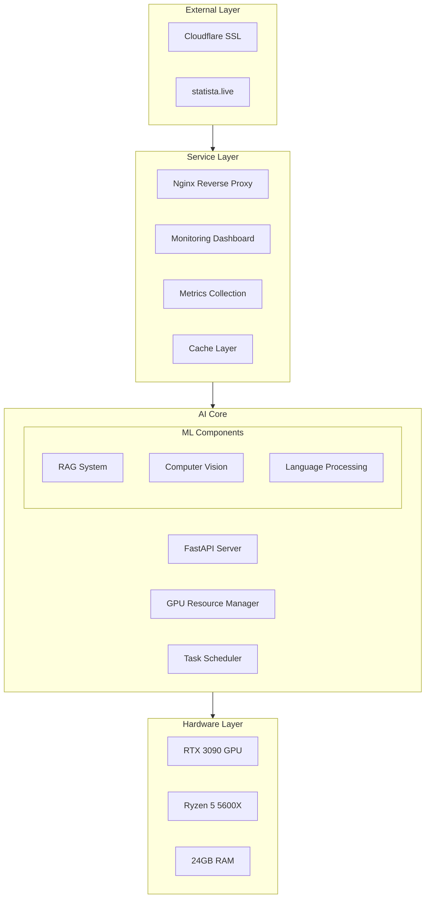
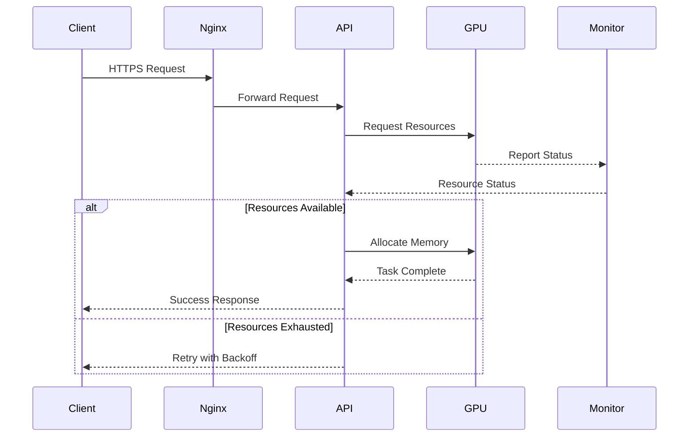

# Project Structure

- .secrets/
- config/
  - config\monitoring/
    - config\monitoring\grafana/
      - config\monitoring\grafana\dashboards/
        - config\monitoring\grafana\dashboards\ai_server.json
      - config\monitoring\grafana\provisioning/
        - config\monitoring\grafana\provisioning\datasources/
          - config\monitoring\grafana\provisioning\datasources\prometheus.yml
      - config\monitoring\grafana\grafana.ini
    - config\monitoring\prometheus/
      - config\monitoring\prometheus\prometheus.yml
      - config\monitoring\prometheus\web.yml
    - config\monitoring\security.yml
  - config\prometheus/
  - config\redis/
    - config\redis\redis.conf
  - config\services/
    - config\services\cloudflare/
    - config\services\nginx/
      - config\services\nginx\certs/
      - config\services\nginx\.htpasswd
      - config\services\nginx\nginx.conf
    - config\services\redis/
  - config\utils/
- data/
  - data\ai/
  - data\models/
  - data\monitoring/
  - data\services/
  - data\utils/
- docker/
  - docker\docker-compose.yml
  - docker\Dockerfile
- docs/
  - docs\api/
  - docs\benchmarks/
  - docs\environment/
  - docs\monitoring/
  - docs\services/
  - docs\setup/
  - docs\utils/
  - docs\validation/
    - docs\validation\validation_20241112_142522.json
- logs/
- scripts/
  - scripts\env_report.py
  - scripts\setup.py
  - scripts\validate.py
- src/
  - src\api/
    - src\api\monitoring/
    - src\api\utils/
    - src\api\v1/
      - src\api\v1\endpoints/
      - src\api\v1\middleware/
      - src\api\v1\models/
    - src\api\__init__.py
    - src\api\config.py
    - src\api\server.py
  - src\core/
    - src\core\gpu/
      - src\core\gpu\__init__.py
      - src\core\gpu\gpu_utils.py
    - src\core\monitoring/
      - src\core\monitoring\metrics.py
      - src\core\monitoring\server.py
    - src\core\security/
    - src\core\utils/
    - src\core\v1/
    - src\core\__init__.py
  - src\ml/
    - src\ml\__init__.py
  - src\monitoring/
  - src\services/
  - src\utils/
    - src\utils\__init__.py
- tests/
- .dockerignore
- .env
- .gitignore
- README.md
- requirements.txt
- setup.py

# File Contents

## config\monitoring\grafana\dashboards\ai_server.json

```

{
  "annotations": {
    "list": []
  },
  "editable": true,
  "fiscalYearStartMonth": 0,
  "graphTooltip": 0,
  "id": 1,
  "links": [],
  "liveNow": true,
  "panels": [
    {
      "datasource": {
        "type": "prometheus",
        "uid": "prometheus"
      },
      "fieldConfig": {
        "defaults": {
          "color": {
            "mode": "palette-classic"
          },
          "custom": {
            "axisCenteredZero": false,
            "axisColorMode": "text",
            "axisLabel": "",
            "axisPlacement": "auto",
            "barAlignment": 0,
            "drawStyle": "line",
            "fillOpacity": 20,
            "gradientMode": "none",
            "hideFrom": {
              "legend": false,
              "tooltip": false,
              "viz": false
            },
            "lineInterpolation": "smooth",
            "lineWidth": 2,
            "pointSize": 5,
            "scaleDistribution": {
              "type": "linear"
            },
            "showPoints": "never",
            "spanNulls": true,
            "stacking": {
              "group": "A",
              "mode": "none"
            },
            "thresholdsStyle": {
              "mode": "off"
            }
          },
          "mappings": [],
          "thresholds": {
            "mode": "absolute",
            "steps": [
              {
                "color": "green",
                "value": null
              },
              {
                "color": "red",
                "value": 80
              }
            ]
          },
          "unit": "percent"
        },
        "overrides": []
      },
      "gridPos": {
        "h": 8,
        "w": 12,
        "x": 0,
        "y": 0
      },
      "id": 1,
      "options": {
        "legend": {
          "calcs": [],
          "displayMode": "list",
          "placement": "bottom",
          "showLegend": true
        },
        "tooltip": {
          "mode": "single",
          "sort": "none"
        }
      },
      "targets": [
        {
          "datasource": {
            "type": "prometheus",
            "uid": "prometheus"
          },
          "expr": "gpu_utilization",
          "refId": "A"
        }
      ],
      "title": "GPU Utilization",
      "type": "timeseries"
    }
  ],
  "refresh": "5s",
  "schemaVersion": 38,
  "style": "dark",
  "tags": [],
  "templating": {
    "list": []
  },
  "time": {
    "from": "now-15m",
    "to": "now"
  },
  "timepicker": {},
  "timezone": "",
  "title": "AI Server Dashboard",
  "version": 0,
  "weekStart": ""
}
```

## config\monitoring\grafana\provisioning\datasources\prometheus.yml

```

apiVersion: 1

datasources:
  - name: Prometheus
    type: prometheus
    access: proxy
    url: http://justica_prometheus:9090
    isDefault: true
    editable: false
    version: 1
```

## config\monitoring\grafana\grafana.ini

```
# Location: E:/justica/config/monitoring/grafana/grafana.ini

[server]
protocol = http
http_port = 3000

[security]
admin_user = fixola
admin_password = As!101010

[users]
allow_sign_up = false

[auth.anonymous]
enabled = false

[dashboards]
default_home_dashboard_path = /etc/grafana/dashboards/ai_server.json
```

## config\monitoring\prometheus\prometheus.yml

```
# Need to create: config/prometheus/prometheus.yml
global:
  scrape_interval: 15s

scrape_configs:
  - job_name: 'gpu_metrics'
    static_configs:
      - targets: ['ai_server:8001']
```

## config\monitoring\prometheus\web.yml

```
# config/prometheus/web.yml
basic_auth_users:
  ${PROMETHEUS_BASIC_AUTH_USER}: ${PROMETHEUS_BASIC_AUTH_PASS_HASH}  # Use bcrypt hash

tls_server_config:
  cert_file: /etc/prometheus/certs/prometheus.crt
  key_file: /etc/prometheus/certs/prometheus.key

http_config:
  http2: true
```

## config\monitoring\security.yml

```
api_rate_limiting:
  enabled: true
  rate: ${RATE_LIMIT_PER_MINUTE}
  per: minute
  burst: 5

cors:
  allowed_origins:
    - https://api.statista.live
    - https://monitor.statista.live
  allowed_methods:
    - GET
    - POST
    - PUT
    - DELETE
  allowed_headers:
    - Authorization
    - Content-Type
  max_age: 3600

ssl:
  enabled: true
  min_version: TLSv1.2
  ciphers:
    - ECDHE-ECDSA-AES128-GCM-SHA256
    - ECDHE-RSA-AES128-GCM-SHA256
    - ECDHE-ECDSA-AES256-GCM-SHA384
    - ECDHE-RSA-AES256-GCM-SHA384

auth:
  jwt_expiry: 3600
  refresh_token_expiry: 604800
  password_hash_algorithm: bcrypt
  password_hash_rounds: 12
```

## config\redis\redis.conf

```
# Basic Configuration
port 6379
bind 127.0.0.1
daemonize no

# Security
requirepass ${REDIS_PASSWORD}
rename-command FLUSHALL ""
rename-command FLUSHDB ""
rename-command DEBUG ""

# Memory Management
maxmemory 4gb
maxmemory-policy allkeys-lru
maxmemory-samples 10

# Persistence
save 900 1
save 300 10
save 60 10000
appendonly yes
appendfsync everysec

# Network
tcp-keepalive 300
timeout 0

# TLS/SSL
tls-port 6380
tls-cert-file /path/to/redis.crt
tls-key-file /path/to/redis.key
tls-ca-cert-file /path/to/ca.crt
```

## config\services\nginx\.htpasswd

```
@"
fixola:`$apr1`$TQenGNz7`$Q35YIm5WFcbSlTM5mHgW80
"@ | Out-File -Encoding utf8 "E:/justica/config/services/nginx/.htpasswd"
```

## config\services\nginx\nginx.conf

```
# Location: E:/justica/config/services/nginx/nginx.conf

events {
    worker_connections 1024;
}

http {
    include       /etc/nginx/mime.types;
    default_type  application/octet-stream;
    
    # Basic settings
    sendfile on;
    tcp_nopush on;
    tcp_nodelay on;
    keepalive_timeout 65;
    types_hash_max_size 2048;

    # SSL settings
    ssl_protocols TLSv1.2 TLSv1.3;
    ssl_prefer_server_ciphers on;
    ssl_ciphers ECDHE-ECDSA-AES128-GCM-SHA256:ECDHE-RSA-AES128-GCM-SHA256;
    ssl_session_cache shared:SSL:10m;
    ssl_session_timeout 1d;

    upstream backend {
        server justica_ai_server:8000;
    }

    # Existing server block
    server {
        listen 80;
        server_name localhost;

        location / {
            proxy_pass http://backend;
            proxy_set_header Host $host;
            proxy_set_header X-Real-IP $remote_addr;
            proxy_set_header X-Forwarded-For $proxy_add_x_forwarded_for;
        }
    }

    # Monitoring Dashboard (Grafana)
    server {
        listen 443 ssl http2;
        server_name monitor.statista.live;

        ssl_certificate /etc/nginx/certs/fullchain.pem;
        ssl_certificate_key /etc/nginx/certs/privkey.pem;

        auth_basic "Monitoring Dashboard";
        auth_basic_user_file /etc/nginx/conf.d/.htpasswd;

        location / {
            proxy_pass http://justica_grafana:3000;
            proxy_http_version 1.1;
            proxy_set_header Upgrade $http_upgrade;
            proxy_set_header Connection 'upgrade';
            proxy_set_header Host $host;
            proxy_cache_bypass $http_upgrade;
        }

        location /prometheus/ {
            proxy_pass http://justica_prometheus:9090/;
            proxy_http_version 1.1;
            proxy_set_header Upgrade $http_upgrade;
            proxy_set_header Connection 'upgrade';
            proxy_set_header Host $host;
            proxy_cache_bypass $http_upgrade;
        }

        location /metrics/ {
            proxy_pass http://justica_ai_server:8001/;
            proxy_http_version 1.1;
            proxy_set_header Host $host;
            proxy_cache_bypass $http_upgrade;
        }
    }

    # HTTP redirect for monitoring
    server {
        listen 80;
        server_name monitor.statista.live;
        return 301 https://$server_name$request_uri;
    }
}
```

## docker\docker-compose.yml

```
version: '3.8'

services:
  nginx:
    container_name: justica_nginx
    image: nginx:alpine
    ports:
      - "80:80"
      - "443:443"
    volumes:
      - ../config/services/nginx/nginx.conf:/etc/nginx/nginx.conf:ro
      - ../config/services/nginx/certs:/etc/nginx/certs:ro
      - ../config/services/nginx/.htpasswd:/etc/nginx/conf.d/.htpasswd:ro
    networks:
      - backend
    restart: unless-stopped

  ai_server:
    container_name: justica_ai_server
    build:
      context: ..
      dockerfile: docker/Dockerfile
    environment:
      - NVIDIA_VISIBLE_DEVICES=0
      - NVIDIA_DRIVER_CAPABILITIES=compute,utility,graphics
      - CUDA_VISIBLE_DEVICES=0
    runtime: nvidia
    ports:
      - "8000:8000"
      - "8001:8001"
    volumes:
      - ../data:/data
    deploy:
      resources:
        reservations:
          devices:
            - driver: nvidia
              count: 1
              capabilities: [gpu]
    networks:
      - backend
    restart: unless-stopped

  redis:
    container_name: justica_redis
    image: redis:alpine
    command: redis-server --requirepass ${REDIS_PASSWORD}
    ports:
      - "6379:6379"
    networks:
      - backend
    restart: unless-stopped

  grafana:
    container_name: justica_grafana
    image: grafana/grafana:latest
    environment:
      - GF_SECURITY_ADMIN_USER=${GRAFANA_ADMIN_USER}
      - GF_SECURITY_ADMIN_PASSWORD=${GRAFANA_ADMIN_PASSWORD}
      - GF_USERS_DEFAULT_THEME=dark
      - GF_AUTH_ANONYMOUS_ENABLED=false
      - GF_SERVER_ROOT_URL=https://monitor.statista.live
    volumes:
      - ../config/monitoring/grafana/dashboards:/etc/grafana/dashboards
      - ../config/monitoring/grafana/provisioning:/etc/grafana/provisioning
      - ../data/monitoring/grafana:/var/lib/grafana
    ports:
      - "3000:3000"
    networks:
      - backend
    restart: unless-stopped

  prometheus:
    container_name: justica_prometheus
    image: prom/prometheus:latest
    ports:
      - "9090:9090"
    volumes:
      - ../config/monitoring/prometheus/prometheus.yml:/etc/prometheus/prometheus.yml
      - ../data/monitoring/prometheus:/prometheus
    command:
      - '--config.file=/etc/prometheus/prometheus.yml'
      - '--storage.tsdb.path=/prometheus'
      - '--web.console.libraries=/usr/share/prometheus/console_libraries'
      - '--web.console.templates=/usr/share/prometheus/consoles'
    networks:
      - backend
    restart: unless-stopped

networks:
  backend:
    driver: bridge
```

## docker\Dockerfile

```
# Location: E:/justica/docker/Dockerfile

FROM nvidia/cuda:12.3.1-runtime-ubuntu22.04

# Set environment variables
ENV PYTHONUNBUFFERED=1 \
    DEBIAN_FRONTEND=noninteractive \
    CUDA_HOME=/usr/local/cuda \
    TORCH_CUDA_ARCH_LIST="8.6" \
    FORCE_CUDA="1" \
    PATH="/usr/local/bin:${PATH}" \
    PYTHON_PATH="/usr/bin/python3"

# Install system dependencies including OpenCV requirements
RUN apt-get update && apt-get install -y \
    python3.10 \
    python3-pip \
    git \
    libgl1-mesa-glx \
    libglib2.0-0 \
    libsm6 \
    libxext6 \
    libxrender-dev \
    libgl1 \
    ffmpeg \
    libx264-dev \
    libopencv-dev \
    && rm -rf /var/lib/apt/lists/* \
    && ln -sf /usr/bin/python3 /usr/bin/python

# Set working directory
WORKDIR /app

# Copy requirements first for better caching
COPY requirements.txt .

# Upgrade pip and install dependencies
RUN python3 -m pip install --no-cache-dir --upgrade pip && \
    python3 -m pip install --no-cache-dir setuptools wheel && \
    python3 -m pip install --no-cache-dir -r requirements.txt && \
    rm -rf /root/.cache/pip/*

# Copy application code
COPY . .

# Health check
HEALTHCHECK --interval=30s --timeout=10s --start-period=5s --retries=3 \
    CMD python3 -c "import torch; assert torch.cuda.is_available()"

# Set Python path
ENV PYTHONPATH=/app

# Default command
CMD ["python3", "-m", "src.api.server"]
```

## docs\validation\validation_20241112_142522.json

```
{
  "timestamp": "2024-11-12T14:25:21.902841",
  "status": "failed",
  "tests": {
    "gpu": {
      "status": "passed",
      "info": {
        "pytorch_version": "2.5.1",
        "cuda_available": true,
        "cuda_version": "11.8",
        "gpu_name": "NVIDIA GeForce RTX 3090",
        "gpu_count": 1,
        "memory": {
          "allocated": "0.00GB",
          "reserved": "0.00GB",
          "max_allocated": "0.00GB"
        },
        "performance_test": {
          "matrix_size": "10000x10000",
          "computation_time": "200.78ms"
        }
      }
    },
    "libraries": {
      "status": "passed",
      "versions": {
        "opencv": "4.7.0",
        "numpy": "1.26.4",
        "pandas": "2.2.3",
        "matplotlib": "3.9.1",
        "seaborn": "0.13.2",
        "scipy": "1.14.1"
      }
    },
    "directories": {
      "status": "failed",
      "missing_directories": [
        "config/services/redis"
      ]
    },
    "resources": {
      "status": "passed",
      "info": {
        "cpu": {
          "cores": 6,
          "threads": 12,
          "usage": "10.8%"
        },
        "memory": {
          "total": "23.9GB",
          "available": "14.5GB",
          "percent": "39.4%"
        },
        "disk": {
          "total": "931.4GB",
          "free": "745.9GB",
          "percent": "19.9%"
        }
      }
    }
  }
}
```

## scripts\env_report.py

```
# scripts/env_report.py

import sys
import torch
import platform
import subprocess
from pathlib import Path
import pkg_resources
import json
from datetime import datetime
import os
import psutil

def get_gpu_info():
    """Get detailed GPU information."""
    try:
        if not torch.cuda.is_available():
            return {"error": "CUDA not available"}
        
        return {
            "gpu_name": torch.cuda.get_device_name(0),
            "cuda_version": torch.version.cuda,
            "gpu_count": torch.cuda.device_count(),
            "current_device": torch.cuda.current_device(),
            "memory": {
                "allocated": f"{torch.cuda.memory_allocated(0)/1024**3:.2f}GB",
                "cached": f"{torch.cuda.memory_reserved(0)/1024**3:.2f}GB",
                "max_allocated": f"{torch.cuda.max_memory_allocated(0)/1024**3:.2f}GB"
            },
            "capabilities": {
                "compute_capability": f"{torch.cuda.get_device_capability(0)[0]}.{torch.cuda.get_device_capability(0)[1]}"
            }
        }
    except Exception as e:
        return {"error": str(e)}

def get_system_info():
    """Get system information."""
    return {
        "platform": platform.platform(),
        "processor": platform.processor(),
        "python_version": sys.version,
        "python_path": sys.executable,
        "cpu_count": psutil.cpu_count(logical=False),
        "memory": {
            "total": f"{psutil.virtual_memory().total/1024**3:.2f}GB",
            "available": f"{psutil.virtual_memory().available/1024**3:.2f}GB",
            "used": f"{psutil.virtual_memory().used/1024**3:.2f}GB",
            "percent": f"{psutil.virtual_memory().percent}%"
        }
    }

def get_conda_info():
    """Get conda environment information."""
    try:
        conda_info = subprocess.check_output(['conda', 'info', '--json']).decode()
        return json.loads(conda_info)
    except Exception as e:
        return {"error": str(e)}

def get_installed_packages():
    """Get list of installed packages and versions."""
    return {pkg.key: pkg.version for pkg in pkg_resources.working_set}

def generate_report():
    """Generate comprehensive environment report."""
    report = {
        "timestamp": datetime.now().isoformat(),
        "system_info": get_system_info(),
        "gpu_info": get_gpu_info(),
        "conda_info": get_conda_info(),
        "installed_packages": get_installed_packages(),
        "environment_variables": {k: v for k, v in os.environ.items() if 'PATH' in k or 'PYTHON' in k or 'CUDA' in k or 'CONDA' in k}
    }
    
    # Save report
    report_path = Path("docs/environment")
    report_path.mkdir(parents=True, exist_ok=True)
    
    timestamp = datetime.now().strftime("%Y%m%d_%H%M%S")
    report_file = report_path / f"env_report_{timestamp}.json"
    
    with open(report_file, 'w') as f:
        json.dump(report, f, indent=2)
    
    print(f"\nEnvironment report generated: {report_file}")
    
    # Print summary
    print("\n=== Environment Summary ===")
    print(f"Python: {sys.version.split()[0]}")
    if torch.cuda.is_available():
        print(f"CUDA: {torch.version.cuda}")
        print(f"GPU: {torch.cuda.get_device_name(0)}")
    print(f"PyTorch: {torch.__version__}")
    print(f"Platform: {platform.platform()}")
    print(f"CPU Cores: {psutil.cpu_count(logical=False)}")
    print(f"Memory: {psutil.virtual_memory().total/1024**3:.2f}GB")
    
    return report

if __name__ == "__main__":
    generate_report()
```

## scripts\setup.py

```
# Location: E:/justica/scripts/setup.py

import os
import sys
import shutil
import ctypes
import secrets
import string
import logging
import json
import subprocess
import socket
import time
from pathlib import Path
from typing import Dict, List, Optional

# Configure logging
logging.basicConfig(
    level=logging.INFO,
    format='%(asctime)s - %(levelname)s - %(message)s'
)
logger = logging.getLogger(__name__)

class SystemSetup:
    """
    Unified system setup handling directories, SSL, authentication, and secrets.
    """
    def __init__(self):
        self.base_dir = Path('E:/justica')
        self.certbot_path = Path(r"C:\Program Files\Certbot\bin\certbot.exe")
        self.required_dirs = [
            'logs',
            'config/services/nginx/certs',
            'config/services/nginx',
            'config/services/redis',
            'config/monitoring/grafana',
            'config/monitoring/prometheus',
            'src/api/v1',
            'src/core/monitoring',
            'src/core/utils',
            'data/ai',
            'data/models',
            'scripts',
            'docs/validation'
        ]

    def setup_all(self):
        """Run all setup procedures."""
        try:
            self.check_admin()
            self.setup_directories()
            
            ssl_success = self.setup_ssl(retries=3)
            if not ssl_success:
                logger.warning("SSL setup incomplete - continuing with other steps")
                
            self.setup_auth()
            self.generate_secrets()
            
            logger.info("System setup completed!")
            if not ssl_success:
                logger.warning("\nNOTE: SSL certificates were not set up.")
                logger.warning("You can run setup again later to complete SSL setup.")
                
        except Exception as e:
            logger.error(f"Setup failed: {e}")
            sys.exit(1)

    def check_admin(self):
        """Check for administrative privileges."""
        try:
            if not ctypes.windll.shell32.IsUserAnAdmin():
                logger.error("This script requires administrative privileges.")
                sys.exit(1)
        except Exception as e:
            logger.error(f"Admin check failed: {e}")
            sys.exit(1)

    def setup_directories(self):
        """Create required directories."""
        try:
            for dir_path in self.required_dirs:
                full_path = self.base_dir / dir_path
                full_path.mkdir(parents=True, exist_ok=True)
                logger.info(f"Directory created or exists: {full_path}")
        except Exception as e:
            logger.error(f"Failed to create directories: {e}")
            sys.exit(1)

    def verify_dns(self, domain: str, retries: int = 3, delay: int = 10) -> bool:
        """Verify DNS configuration for domain with retries."""
        for attempt in range(retries):
            try:
                socket.gethostbyname(domain)
                return True
            except socket.gaierror:
                if attempt < retries - 1:
                    logger.warning(f"DNS verification failed for {domain}, retrying in {delay} seconds...")
                    time.sleep(delay)
                else:
                    return False

    def setup_ssl(self, retries: int = 1) -> bool:
        """Set up SSL certificates using Certbot."""
        try:
            if not self.certbot_path.exists():
                logger.error(f"Certbot not found at {self.certbot_path}")
                logger.error("Please install Certbot using 'winget install certbot'")
                return False

            domains = [
                "statista.live",
                "api.statista.live",
                "monitor.statista.live"
            ]

            # Verify DNS for all domains
            dns_issues = []
            for domain in domains:
                if not self.verify_dns(domain):
                    dns_issues.append(domain)

            if dns_issues:
                logger.error("DNS verification failed for the following domains:")
                for domain in dns_issues:
                    logger.error(f"  - {domain}")
                logger.error("\nPlease ensure:")
                logger.error("1. Domain DNS records are properly configured")
                logger.error("2. DNS changes have propagated (may take up to 48 hours)")
                logger.error("3. Your domains point to the correct IP address")
                return False

            email = input("Enter your email for SSL certificate registration: ")
            
            cmd = [
                str(self.certbot_path),
                "certonly",
                "--standalone",
                "--preferred-challenges", "http",
                "--agree-tos",
                "--email", email
            ] + [item for domain in domains for item in ("-d", domain)]

            for attempt in range(retries):
                logger.info(f"Running Certbot (attempt {attempt + 1}/{retries})...")
                result = subprocess.run(cmd, capture_output=True, text=True)
                
                if result.returncode == 0:
                    logger.info("SSL certificates generated successfully")
                    
                    cert_path = Path(r"C:\Certbot\live\statista.live")
                    if not cert_path.exists():
                        logger.error(f"Certificates not found at {cert_path}")
                        return False

                    nginx_cert_path = self.base_dir / 'config' / 'services' / 'nginx' / 'certs'
                    nginx_cert_path.mkdir(parents=True, exist_ok=True)
                    
                    for cert_file in ["fullchain.pem", "privkey.pem"]:
                        shutil.copy2(cert_path / cert_file, nginx_cert_path / cert_file)
                    
                    logger.info(f"Certificates copied to {nginx_cert_path}")
                    return True
                else:
                    logger.error(f"Certbot failed: {result.stderr}")
                    if attempt < retries - 1:
                        logger.info("Retrying SSL setup...")
                    else:
                        return False

        except Exception as e:
            logger.error(f"SSL setup failed: {e}")
            return False

    def setup_auth(self):
        """Set up authentication credentials."""
        try:
            username = input("Enter username for dashboard access: ")
            password = input("Enter password for dashboard access: ")

            if len(password) < 8:
                logger.error("Password must be at least 8 characters long.")
                sys.exit(1)

            salt = secrets.token_bytes(16)
            hashed_pw = self.hash_password(password, salt)

            htpasswd_path = self.base_dir / 'config' / 'services' / 'nginx' / '.htpasswd'
            htpasswd_path.parent.mkdir(parents=True, exist_ok=True)
            with open(htpasswd_path, 'w') as f:
                f.write(f"{username}:{hashed_pw}\n")
            logger.info(f"Authentication credentials created at {htpasswd_path}")

        except Exception as e:
            logger.error(f"Failed to set up authentication: {e}")
            sys.exit(1)

    def generate_secrets(self):
        """Generate secret keys and configuration variables."""
        secrets_file = self.base_dir / 'config' / 'secrets.json'
        try:
            secrets_data = {
                'SECRET_KEY': self.generate_secret_key(),
                'REDIS_PASSWORD': self.generate_password(),
                'GRAFANA_ADMIN_USER': 'admin',
                'GRAFANA_ADMIN_PASSWORD': self.generate_password(),
                'AI_DATA_PATH': str(self.base_dir / 'data' / 'ai'),
                'MODEL_CACHE_PATH': str(self.base_dir / 'data' / 'models')
            }
            with open(secrets_file, 'w') as f:
                json.dump(secrets_data, f, indent=4)
            logger.info(f"Secrets generated at {secrets_file}")
        except Exception as e:
            logger.error(f"Failed to generate secrets: {e}")
            sys.exit(1)

    def hash_password(self, password: str, salt: bytes) -> str:
        """Hash password using SHA256."""
        import hashlib
        dk = hashlib.pbkdf2_hmac('sha256', password.encode(), salt, 100000)
        return salt.hex() + dk.hex()

    def generate_secret_key(self, length: int = 50) -> str:
        """Generate a Django-style SECRET_KEY."""
        chars = 'abcdefghijklmnopqrstuvwxyz0123456789!@#$%^&*(-_=+)'
        return ''.join(secrets.choice(chars) for _ in range(length))

    def generate_password(self, length: int = 12) -> str:
        """Generate a random password."""
        chars = string.ascii_letters + string.digits + '!@#$%^&*()'
        return ''.join(secrets.choice(chars) for _ in range(length))

if __name__ == "__main__":
    setup = SystemSetup()
    setup.setup_all()
```

## scripts\validate.py

```
# Location: E:/justica/scripts/validate.py

import os
import sys
import torch
import cv2
import numpy as np
import pandas as pd
import logging
import psutil
import docker
import json
import redis
from pathlib import Path
from datetime import datetime
from dotenv import load_dotenv

# Configure logging
logging.basicConfig(
    level=logging.INFO,
    format='%(asctime)s - %(levelname)s - %(message)s'
)
logger = logging.getLogger(__name__)

class UnifiedValidator:
    """
    Unified system validator that combines GPU, services, config, and directory validation.
    """
    def __init__(self):
        self.results = {
            "timestamp": datetime.now().isoformat(),
            "status": "initializing",
            "tests": {}
        }
        self.docker_client = docker.from_env()
        
        # Load environment variables
        load_dotenv()

    def validate_all(self):
        """Run all validation checks."""
        try:
            self.validate_environment()
            self.validate_gpu()
            self.validate_services()
            self.validate_directories()
            self.validate_redis()
            self.validate_system_resources()
            
            # Set overall status
            all_passed = all(test["status"] == "passed" for test in self.results["tests"].values())
            self.results["status"] = "passed" if all_passed else "failed"
            
            # Save results
            self.save_results()
            
        except Exception as e:
            logger.error(f"Validation failed: {str(e)}")
            self.results["status"] = "error"
            self.results["error"] = str(e)

    def validate_environment(self):
        """Validate environment variables."""
        required_vars = [
            'CLOUDFLARE_TOKEN',
            'API_SECRET_KEY',
            'REDIS_PASSWORD',
            'POSTGRES_PASSWORD',
            'GRAFANA_ADMIN_PASSWORD'
        ]
        
        missing = []
        for var in required_vars:
            if not os.getenv(var):
                missing.append(var)
        
        self.results["tests"]["environment"] = {
            "status": "passed" if not missing else "failed",
            "missing_variables": missing
        }

    def validate_gpu(self):
        """Validate GPU configuration and performance."""
        try:
            gpu_info = {
                "pytorch_version": torch.__version__,
                "cuda_available": torch.cuda.is_available(),
                "cuda_version": torch.version.cuda if torch.cuda.is_available() else None,
            }

            if torch.cuda.is_available():
                gpu_info.update({
                    "gpu_name": torch.cuda.get_device_name(0),
                    "gpu_count": torch.cuda.device_count(),
                    "memory": {
                        "allocated": f"{torch.cuda.memory_allocated()/1024**3:.2f}GB",
                        "reserved": f"{torch.cuda.memory_reserved()/1024**3:.2f}GB",
                        "max_allocated": f"{torch.cuda.max_memory_allocated()/1024**3:.2f}GB"
                    }
                })

                # Performance test
                size = 10000
                x = torch.randn(size, size, device='cuda')
                start_time = torch.cuda.Event(enable_timing=True)
                end_time = torch.cuda.Event(enable_timing=True)
                
                start_time.record()
                result = torch.matmul(x, x)
                end_time.record()
                torch.cuda.synchronize()
                
                gpu_info["performance_test"] = {
                    "matrix_size": f"{size}x{size}",
                    "computation_time": f"{start_time.elapsed_time(end_time):.2f}ms"
                }

            self.results["tests"]["gpu"] = {
                "status": "passed",
                "info": gpu_info
            }
        except Exception as e:
            logger.error(f"GPU validation failed: {str(e)}")
            self.results["tests"]["gpu"] = {
                "status": "failed",
                "error": str(e)
            }

    def validate_services(self):
        """Validate Docker services."""
        try:
            required_services = {
                'justica_ai_server': 8000,
                'justica_grafana': 3000,
                'justica_prometheus': 9090,
                'justica_redis': 6379,
                'justica_nginx': 80
            }
            
            containers = self.docker_client.containers.list()
            running_containers = {c.name: c for c in containers}
            
            service_status = {}
            for service_name, port in required_services.items():
                if service_name in running_containers:
                    container = running_containers[service_name]
                    service_status[service_name] = {
                        "status": container.status,
                        "port": port
                    }
                else:
                    service_status[service_name] = {
                        "status": "not_found",
                        "port": port
                    }
            
            self.results["tests"]["services"] = {
                "status": "passed" if all(s["status"] == "running" for s in service_status.values()) else "failed",
                "services": service_status
            }
        except Exception as e:
            logger.error(f"Service validation failed: {str(e)}")
            self.results["tests"]["services"] = {
                "status": "failed",
                "error": str(e)
            }

    def validate_directories(self):
        """Validate project directory structure."""
        required_dirs = [
            "config/monitoring/grafana",
            "config/monitoring/prometheus",
            "config/services/cloudflare",
            "config/services/redis",
            "scripts/monitoring",
            "scripts/utils",
            "src/api/v1",
            "src/core/monitoring",
            "src/core/utils",
            "data/ai",
            "data/models"
        ]
        
        missing_dirs = []
        for dir_path in required_dirs:
            full_path = Path(dir_path)
            if not full_path.exists():
                missing_dirs.append(dir_path)
                
        self.results["tests"]["directories"] = {
            "status": "passed" if not missing_dirs else "failed",
            "missing_directories": missing_dirs
        }

    def validate_redis(self):
        """Validate Redis connection."""
        try:
            r = redis.Redis(
                host='localhost',
                port=int(os.getenv('REDIS_PORT', 6379)),
                password=os.getenv('REDIS_PASSWORD'),
                ssl=os.getenv('REDIS_TLS_ENABLED', 'true').lower() == 'true'
            )
            r.ping()
            
            self.results["tests"]["redis"] = {
                "status": "passed",
                "info": {
                    "connected": True,
                    "port": os.getenv('REDIS_PORT', 6379)
                }
            }
        except Exception as e:
            logger.error(f"Redis validation failed: {str(e)}")
            self.results["tests"]["redis"] = {
                "status": "failed",
                "error": str(e)
            }

    def validate_system_resources(self):
        """Validate system resources."""
        try:
            memory = psutil.virtual_memory()
            disk = psutil.disk_usage('/')
            
            resources = {
                "cpu": {
                    "cores": psutil.cpu_count(logical=False),
                    "threads": psutil.cpu_count(logical=True),
                    "usage": f"{psutil.cpu_percent()}%"
                },
                "memory": {
                    "total": f"{memory.total/1024**3:.1f}GB",
                    "available": f"{memory.available/1024**3:.1f}GB",
                    "percent": f"{memory.percent}%"
                },
                "disk": {
                    "total": f"{disk.total/1024**3:.1f}GB",
                    "free": f"{disk.free/1024**3:.1f}GB",
                    "percent": f"{disk.percent}%"
                }
            }
            
            self.results["tests"]["resources"] = {
                "status": "passed",
                "info": resources
            }
        except Exception as e:
            logger.error(f"Resource validation failed: {str(e)}")
            self.results["tests"]["resources"] = {
                "status": "failed",
                "error": str(e)
            }

    def save_results(self):
        """Save validation results to file."""
        timestamp = datetime.now().strftime("%Y%m%d_%H%M%S")
        output_dir = Path("docs/validation")
        output_dir.mkdir(parents=True, exist_ok=True)
        
        output_file = output_dir / f"validation_{timestamp}.json"
        with open(output_file, 'w') as f:
            json.dump(self.results, f, indent=2)
            
        logger.info(f"Validation results saved to: {output_file}")

def main():
    """Main execution function."""
    validator = UnifiedValidator()
    validator.validate_all()
    
    # Print summary
    print("\n=== Validation Summary ===")
    print(f"Status: {validator.results['status']}")
    for test_name, test_results in validator.results["tests"].items():
        print(f"\n{test_name.upper()}: {test_results['status']}")
        if test_results["status"] == "failed" and "error" in test_results:
            print(f"Error: {test_results['error']}")

if __name__ == "__main__":
    main()
```

## src\api\__init__.py

```

```

## src\api\config.py

```
# src/api/config.py

from pydantic import BaseSettings, SecretStr, Field
from typing import List, Optional
import os
from pathlib import Path

class Settings(BaseSettings):
    """Server configuration settings using Pydantic with environment variables."""
    
    # Project Settings
    PROJECT_NAME: str = "GPU-Accelerated AI Server"
    API_V1_STR: str = "/api/v1"
    DEBUG: bool = False
    
    # API Settings
    API_SECRET_KEY: SecretStr = Field(..., env='API_SECRET_KEY')
    API_RATE_LIMIT: int = 100
    API_RATE_LIMIT_PERIOD: int = 60
    BACKEND_CORS_ORIGINS: List[str] = ["*"]
    
    # Server Settings
    HOST: str = "0.0.0.0"
    PORT: int = 8000
    WORKERS: int = 4
    
    # GPU Settings
    GPU_MEMORY_FRACTION: float = 0.9
    MIN_MEMORY_AVAILABLE: int = 4000  # Minimum 4GB required
    MAX_BATCH_SIZE: int = 32
    
    # Redis Settings
    REDIS_HOST: str = "localhost"
    REDIS_PORT: int = 6379
    REDIS_PASSWORD: SecretStr = Field(..., env='REDIS_PASSWORD')
    REDIS_TLS_ENABLED: bool = True
    REDIS_DB: int = 0
    
    # Storage Settings
    AI_DATA_PATH: Path = Field(..., env='AI_DATA_PATH')
    MODEL_CACHE_PATH: Path = Field(..., env='MODEL_CACHE_PATH')
    
    # Monitoring Settings
    PROMETHEUS_PORT: int = 9090
    GRAFANA_PORT: int = 3000
    
    class Config:
        env_file = '.env'
        env_file_encoding = 'utf-8'
        case_sensitive = True
        
        @classmethod
        def parse_env_var(cls, field_name: str, raw_val: str) -> any:
            if field_name.endswith('_PATH'):
                return Path(raw_val)
            return cls.json_loads(raw_val)

# Create settings instance
settings = Settings()
```

## src\api\server.py

```
# E:/justica/src/api/server.py

from fastapi import FastAPI, File, UploadFile, HTTPException
from fastapi.middleware.cors import CORSMiddleware
from fastapi.responses import JSONResponse
import torch
import cv2
import numpy as np
from pathlib import Path
from typing import Dict, List, Optional
import logging

# Fix the import path
from src.core.gpu.gpu_utils import GPUManager  # Changed from src.core.gpu_utils

# Configure logging
logging.basicConfig(level=logging.INFO)
logger = logging.getLogger(__name__)

# Initialize FastAPI app
app = FastAPI(
    title="GPU-Accelerated AI Server",
    description="High-performance AI server leveraging RTX 3090",
    version="0.1.0"
)

# Add CORS middleware
app.add_middleware(
    CORSMiddleware,
    allow_origins=["*"],
    allow_credentials=True,
    allow_methods=["*"],
    allow_headers=["*"],
)

# Initialize GPU Manager
gpu_manager = GPUManager()

@app.get("/health")
async def health_check() -> Dict:
    """
    Check server health and GPU status.
    """
    try:
        gpu_stats = gpu_manager.get_gpu_stats()
        return {
            "status": "healthy",
            "gpu_available": torch.cuda.is_available(),
            "gpu_info": {
                "name": torch.cuda.get_device_name(0),
                "memory_allocated": f"{torch.cuda.memory_allocated()/1e9:.2f}GB",
                "memory_reserved": f"{torch.cuda.memory_reserved()/1e9:.2f}GB"
            },
            "gpu_stats": gpu_stats
        }
    except Exception as e:
        logger.error(f"Health check failed: {str(e)}")
        raise HTTPException(status_code=500, detail=str(e))

@app.post("/process-image")
async def process_image(file: UploadFile = File(...)):
    """
    Process an uploaded image using GPU-accelerated OpenCV.
    """
    try:
        contents = await file.read()
        np_image = np.frombuffer(contents, np.uint8)
        image = cv2.imdecode(np_image, cv2.IMREAD_COLOR)

        # Upload image to GPU
        gpu_image = cv2.cuda_GpuMat()
        gpu_image.upload(image)

        # Apply Gaussian Blur on GPU
        gpu_blurred = cv2.cuda.GaussianBlur(gpu_image, (15, 15), 0)
        result_image = gpu_blurred.download()

        _, buffer = cv2.imencode('.jpg', result_image)
        return JSONResponse(content={"status": "success", "data": buffer.tobytes().decode('latin1')})
    except Exception as e:
        logger.error(f"Image processing failed: {str(e)}")
        raise HTTPException(status_code=500, detail=str(e))

@app.get("/gpu-info")
async def get_gpu_info() -> Dict:
    """
    Get detailed GPU information.
    """
    try:
        if not torch.cuda.is_available():
            raise Exception("CUDA is not available")

        gpu_properties = torch.cuda.get_device_properties(0)
        return {
            "name": gpu_properties.name,
            "total_memory": f"{gpu_properties.total_memory / 1e9:.2f} GB",
            "multi_processor_count": gpu_properties.multi_processor_count,
            "cuda_cores": gpu_manager.get_cuda_cores(0),
            "compute_capability": f"{gpu_properties.major}.{gpu_properties.minor}"
        }
    except Exception as e:
        logger.error(f"Failed to get GPU info: {str(e)}")
        raise HTTPException(status_code=500, detail=str(e))

@app.post("/run-model")
async def run_model(data: Dict):
    """
    Run inference on a given input using a pre-loaded model.
    """
    try:
        # Placeholder for model inference
        input_data = data.get("input")
        if input_data is None:
            raise ValueError("No input data provided")

        # Example dummy model operation
        device = torch.device("cuda" if torch.cuda.is_available() else "cpu")
        input_tensor = torch.tensor(input_data).to(device)
        output = input_tensor * 2  # Dummy operation

        return {"status": "success", "output": output.cpu().tolist()}
    except Exception as e:
        logger.error(f"Model inference failed: {str(e)}")
        raise HTTPException(status_code=500, detail=str(e))

if __name__ == "__main__":
    import uvicorn
    uvicorn.run(app, host="0.0.0.0", port=8000)
```

## src\core\gpu\__init__.py

```
from .gpu_utils import GPUManager  # Export GPUManager for easier importing

```

## src\core\gpu\gpu_utils.py

```
# src/core/gpu_utils.py

import torch
import logging
from typing import Dict, Optional, List
import psutil
import GPUtil
from dataclasses import dataclass

@dataclass
class GPUStats:
    """Data class for GPU statistics"""
    id: int
    load: float  # GPU utilization %
    memory_total: int  # Total memory in MB
    memory_used: int  # Used memory in MB
    memory_free: int  # Free memory in MB
    temperature: float  # Temperature in Celsius
    power_draw: float  # Power usage in Watts

class GPUManager:
    """
    Manages GPU resources and provides utilities for monitoring and allocation.
    This is a core component used by the distributed server to manage GPU workloads
    across different AI tasks (RAG, video translation, etc.).
    """
    def __init__(self, log_level: int = logging.INFO):
        self.logger = logging.getLogger(__name__)
        self.logger.setLevel(log_level)
        
        if not torch.cuda.is_available():
            raise RuntimeError("No CUDA-capable GPU detected")
        
        self.device_count = torch.cuda.device_count()
        self.logger.info(f"Initialized GPUManager with {self.device_count} devices")

    def get_gpu_stats(self, device_id: Optional[int] = None) -> Dict[int, GPUStats]:
        """
        Get current statistics for all GPUs or a specific GPU.
        
        Args:
            device_id: Optional specific GPU ID to query
            
        Returns:
            Dictionary mapping GPU IDs to their statistics
        """
        gpus = GPUtil.getGPUs()
        stats = {}
        
        for gpu in gpus:
            if device_id is not None and gpu.id != device_id:
                continue
                
            stats[gpu.id] = GPUStats(
                id=gpu.id,
                load=gpu.load * 100,
                memory_total=gpu.memoryTotal,
                memory_used=gpu.memoryUsed,
                memory_free=gpu.memoryFree,
                temperature=gpu.temperature,
                power_draw=gpu.powerDraw if hasattr(gpu, 'powerDraw') else 0.0
            )
            
        return stats

    def allocate_optimal_device(self, required_memory_mb: int = 0) -> int:
        """
        Allocates the most suitable GPU for a given task based on current load and memory.
        
        Args:
            required_memory_mb: Minimum required GPU memory in MB
            
        Returns:
            ID of the optimal GPU device
            
        Raises:
            RuntimeError: If no GPU with sufficient memory is available
        """
        stats = self.get_gpu_stats()
        best_device = None
        best_score = float('inf')
        
        for device_id, gpu_stat in stats.items():
            if gpu_stat.memory_free < required_memory_mb:
                continue
                
            # Score based on load and available memory
            score = (gpu_stat.load * 0.7) + ((gpu_stat.memory_used / gpu_stat.memory_total) * 0.3)
            
            if score < best_score:
                best_score = score
                best_device = device_id
                
        if best_device is None:
            raise RuntimeError(f"No GPU with required memory ({required_memory_mb}MB) available")
            
        return best_device

    def get_system_memory_usage(self) -> Dict[str, float]:
        """
        Get system memory statistics.
        
        Returns:
            Dictionary containing system memory usage information
        """
        memory = psutil.virtual_memory()
        return {
            "total_gb": memory.total / (1024**3),
            "used_gb": memory.used / (1024**3),
            "free_gb": memory.available / (1024**3),
            "percent_used": memory.percent
        }

    def cleanup_gpu_memory(self, device_id: Optional[int] = None):
        """
        Cleanup CUDA memory for specific or all devices.
        
        Args:
            device_id: Optional specific GPU ID to clean
        """
        if device_id is not None:
            torch.cuda.empty_cache()
            return
            
        for dev_id in range(self.device_count):
            with torch.cuda.device(dev_id):
                torch.cuda.empty_cache()
                
        self.logger.info("GPU memory cleaned up")
```

## src\core\monitoring\metrics.py

```
# src/core/metrics.py

import prometheus_client as prom
from typing import Dict
import time

class AIServerMetrics:
    def __init__(self):
        # Task Metrics
        self.active_tasks = prom.Gauge('ai_active_tasks', 'Currently running AI tasks')
        self.task_duration = prom.Histogram('ai_task_duration_seconds', 'Task processing time',
            buckets=[.1, .5, 1.0, 2.5, 5.0, 7.5, 10.0, 15.0, 30.0])
        
        # Storage Metrics
        self.storage_usage = prom.Gauge('ai_storage_usage_bytes', 'Storage space used')
        self.model_cache_size = prom.Gauge('ai_model_cache_bytes', 'Model cache size')
        
        # Performance Metrics
        self.inference_time = prom.Histogram('ai_inference_seconds', 'Model inference time',
            buckets=[.01, .05, .1, .25, .5, .75, 1.0])
        
    def track_task(self, func):
        """Decorator to track task metrics"""
        def wrapper(*args, **kwargs):
            self.active_tasks.inc()
            start = time.time()
            try:
                result = func(*args, **kwargs)
                self.task_duration.observe(time.time() - start)
                return result
            finally:
                self.active_tasks.dec()
        return wrapper
```

## src\core\monitoring\server.py

```

import psutil
import torch
import time
from prometheus_client import start_http_server, Gauge
import GPUtil
from pathlib import Path
import logging

class GPUMonitor:
    def __init__(self):
        # GPU Metrics
        self.gpu_utilization = Gauge('gpu_utilization', 'GPU Utilization in %')
        self.gpu_memory_used = Gauge('gpu_memory_used', 'GPU Memory Used in MB')
        self.gpu_memory_total = Gauge('gpu_memory_total', 'GPU Total Memory in MB')
        self.gpu_temperature = Gauge('gpu_temperature', 'GPU Temperature in Celsius')
        self.gpu_power_draw = Gauge('gpu_power_draw', 'GPU Power Usage in Watts')
        
        # System Metrics
        self.cpu_usage = Gauge('cpu_usage', 'CPU Usage in %')
        self.system_memory_used = Gauge('system_memory_used', 'System Memory Used in GB')
        self.disk_usage = Gauge('disk_usage', 'Disk Usage in %')
        
        # AI Server Metrics
        self.active_tasks = Gauge('active_tasks', 'Number of Active AI Tasks')
        self.queue_size = Gauge('queue_size', 'Number of Tasks in Queue')
        self.model_loading_time = Gauge('model_loading_time', 'Time to Load Models in seconds')
        
        # Storage Metrics
        self.storage_path = Path('/data')
        self.storage_used = Gauge('storage_used', 'Storage Used in GB')
        self.storage_free = Gauge('storage_free', 'Storage Free in GB')

    def collect_metrics(self):
        """Collect all metrics."""
        try:
            # GPU Metrics
            gpus = GPUtil.getGPUs()
            for gpu in gpus:
                self.gpu_utilization.set(gpu.load * 100)
                self.gpu_memory_used.set(gpu.memoryUsed)
                self.gpu_memory_total.set(gpu.memoryTotal)
                self.gpu_temperature.set(gpu.temperature)
                if hasattr(gpu, 'powerDraw'):
                    self.gpu_power_draw.set(gpu.powerDraw)

            # System Metrics
            self.cpu_usage.set(psutil.cpu_percent())
            self.system_memory_used.set(psutil.virtual_memory().used / (1024**3))
            self.disk_usage.set(psutil.disk_usage('/').percent)

            # Storage Metrics
            if self.storage_path.exists():
                usage = psutil.disk_usage(str(self.storage_path))
                self.storage_used.set(usage.used / (1024**3))
                self.storage_free.set(usage.free / (1024**3))

        except Exception as e:
            logging.error(f"Error collecting metrics: {str(e)}")

def run_monitoring_server(port=8001):
    """Run the monitoring server."""
    start_http_server(port)
    monitor = GPUMonitor()
    
    while True:
        monitor.collect_metrics()
        time.sleep(1)  # Collect metrics every second

if __name__ == "__main__":
    run_monitoring_server()
```

## src\core\__init__.py

```

```

## src\ml\__init__.py

```

```

## src\utils\__init__.py

```

```

## .dockerignore

```
# .dockerignore

# Git
.git
.gitignore

# Python
__pycache__
*.pyc
*.pyo
*.pyd
.Python
env
pip-log.txt
pip-delete-this-directory.txt
.tox
.coverage
.coverage.*
.cache
nosetests.xml
coverage.xml
*.cover
*.log
.pytest_cache
.python-version

# Virtual Environment
venv
ENV
env

# IDEs
.idea
.vscode
*.swp
*.swo

# OS
.DS_Store
Thumbs.db
```

## README.md

```
# GPU-Accelerated AI Server Infrastructure

## 🚀 Overview
Enterprise-grade AI infrastructure leveraging RTX 3090 (24GB VRAM) for distributed computing, designed for high-performance AI applications.


## 🏗 Architecture

### System Architecture


### Resource Management


## 💻 Core Components

### AI Server
- FastAPI-based REST API
- Real-time GPU resource management
- Task queue and scheduling
- Automatic memory optimization

### Monitoring
- Real-time GPU metrics
- System resource tracking
- Task performance analytics
- Alert system

### Security
- Cloudflare SSL/TLS
- Rate limiting
- Authentication system
- Network isolation

## 📊 Performance Metrics

### GPU Benchmarks
```python
# Latest benchmark results
{
    "matmul_10000x10000": {
        "compute_time_ms": 84.02,
        "tflops": 11.96
    },
    "memory_bandwidth": {
        "size_gb": 0.5,
        "bandwidth_gbps": 170.04
    }
}
```

### System Specifications
| Component | Specification | Performance |
|-----------|--------------|-------------|
| GPU | RTX 3090 24GB | 35.58 TFLOPS |
| CPU | Ryzen 5 5600X | 6C/12T @ 4.6GHz |
| RAM | 24GB DDR4 | 3200MHz |
| Storage | NVMe SSD | 3.5GB/s Read |

## 🚀 Quick Start

### Prerequisites
```bash
# System Requirements
NVIDIA Driver >= 566.03
CUDA >= 12.3.1
Docker + NVIDIA Container Toolkit
Python >= 3.10
```

### Installation
```bash
# Clone and setup
git clone https://github.com/geek2geeks/justica.git
cd justica

# Create environment
conda create -n pytorch_gpu python=3.10
conda activate pytorch_gpu

# Install dependencies
pip install -r requirements.txt

# Start services
docker-compose -f docker/docker-compose.yml up -d
```

### Validation
```bash
# Run system validation
python scripts/monitoring/validate.py

# Run GPU benchmarks
python scripts/utils/benchmark.py
```

## 📋 API Documentation

### Core Endpoints
```yaml
/health:
  GET: System health status
  
/gpu/stats:
  GET: Real-time GPU metrics

/process-image:
  POST: GPU-accelerated image processing
```

### Example Usage
```python
import requests

# Health check
response = requests.get("https://api.statista.live/health")
print(response.json())

# GPU stats
stats = requests.get("https://api.statista.live/gpu/stats")
print(stats.json())
```

## 🔧 Development

### Directory Structure
```
justica/
├── config/            # Service configurations
├── src/              # Source code
│   ├── api/          # FastAPI application
│   ├── core/         # Core utilities
│   └── ml/           # ML components
├── scripts/          # Utility scripts
└── docker/           # Container configs
```

### Testing
```bash
# Run all tests
python -m pytest tests/

# Run GPU tests
python -m pytest tests/unit/test_gpu.py
```

## 📈 Status & Roadmap

### Current Status
- ✅ GPU Infrastructure
- ✅ Basic API
- ✅ Monitoring
- 🚧 SSL/Domain
- 📅 ML Pipeline

### Upcoming Features
1. RAG System Integration
2. Video Processing Pipeline
3. Custom ML Model Support
4. Advanced Monitoring

## 📞 Support

### Contact
- **Developer**: Pedro Rodrigues
- **Email**: ukpedropt@hotmail.com
- **GitHub**: [@geek2geeks](https://github.com/geek2geeks)

### Contributing
1. Fork the repository
2. Create feature branch
3. Submit pull request

## 📄 License
MIT License - see [LICENSE.md](LICENSE.md)
```

## requirements.txt

```
# Machine Learning
--extra-index-url https://download.pytorch.org/whl/cu121
torch
torchvision
torchaudio

# Computer Vision
opencv-python==4.8.1.78

# Data Science & Analytics
numpy==1.26.4
pandas==2.2.3
matplotlib==3.9.1
seaborn==0.13.2
scipy==1.14.1

# API & Web Framework
fastapi==0.109.1
uvicorn[standard]==0.27.1
python-multipart==0.0.7
pydantic==2.6.1
# Removed explicit starlette version as it's managed by FastAPI

# System & GPU Monitoring
gputil==1.4.0
psutil==5.9.8

# Task Queue & Cache
celery==5.3.6
redis==5.0.1

# Development & Testing
pytest==8.0.0
pytest-cov==4.1.0
pytest-asyncio==0.23.5
black==24.1.1
isort==5.13.2
mypy==1.8.0

# Infrastructure & Configuration
docker==7.0.0
pyyaml==6.0.1
python-dotenv==1.0.1
```

## setup.py

```
from setuptools import setup, find_packages

setup(
    name="server-ai",
    version="0.1.0",
    packages=find_packages(),
    install_requires=[
        line.strip()
        for line in open("requirements.txt").readlines()
        if line.strip() and not line.startswith("#")
    ],
    author="geek2geeks",
    description="High-performance AI server infrastructure optimized for RTX 3090",
    keywords="AI, GPU, PyTorch, CUDA, RTX3090",
    url="https://github.com/geek2geeks/server-ai",
    python_requires=">=3.10",
)
```

